# README #

This README documents whatever steps are necessary to use swagger more effectively.
Following the steps here should help demonstrate that goal.

### What is this repository for? ###

* In references section in this readme I refer to two excellent tutorial approaches for using swagger with spring boot. For convenience I refer to them as approach A and approach B.  

| Requirement/Issue        | Approach A        | Approach B  |
| ------------- |:-------------:| -----:|
| Centralised approach      | Yes | No |
| Demonstrates validation      | No      |   Yes |
| javax.validation.constraints will cause automatic documentation | NA      |    No see note on minLength in references |

* While swagger yaml/json supports the notions of minLength, maxLength there is something wanting in swagger integration with spring boot rest services when using @Valid.  
* The developer must not only fill his code with javax.validation.constraints but must also offset with additional swagger annotations and hope that the generated documentation is adequately illustrative about the constraints. Any mismatch between javax.validation.constraints and swagger annotations will imply miscommunication.   Considering that most controllers would invoke a service it will make you wonder whether you are writing more code or annotations. :)
* This here is an effort to avoid that duplication of concerns in validation implementation and its documentation communication.
* Had two choices- Make a complete implementation from scratch i.e generate a swagger yaml specification using reflection and spring metadata vs use existing implementation and add value to it. Initially taken this second approach for quicker completion. Didnt like the results. Then took a middle path for now. Use the original swagger as much as possible. But refresh the actual operations and definitions using spring metadatada and reflection.

### what does this really look like
##### Enriched model definitions  
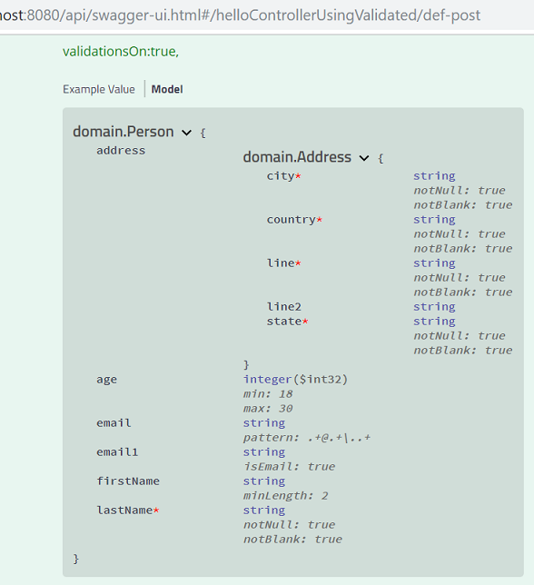
##### Regular model definitions
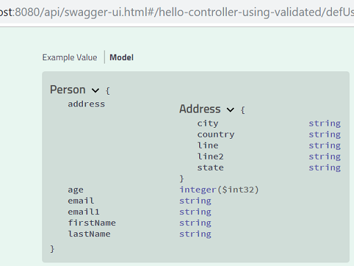

##### Enriched parameter definitions
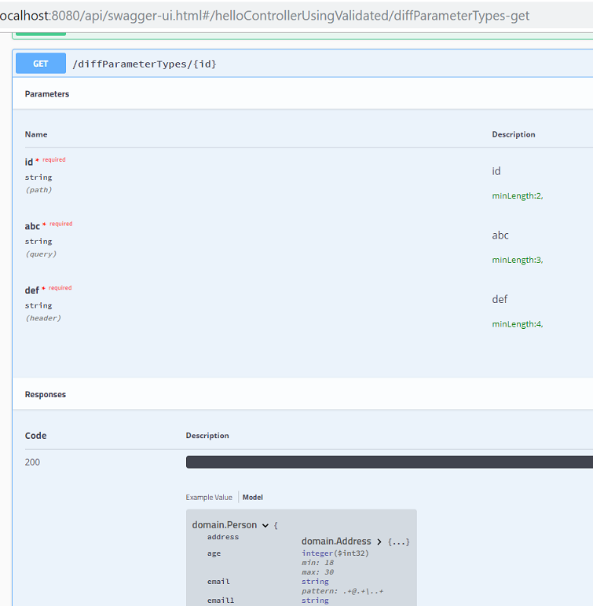

##### Query/form parameter
Swagger UI integration with query/form parameter is not exactly perfect and one would prefer using @RequestBody rather than converting models into query/form parameters. Still we can compare what is available with regular swagger and the enriched swagger
###### Enriched query/form parameter definitions  
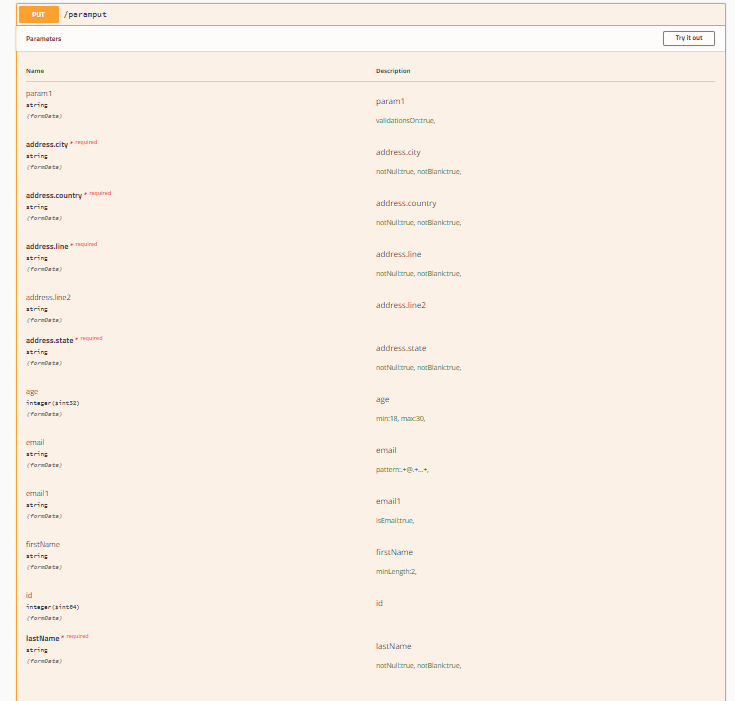
###### Regular query/form parameter  definitions
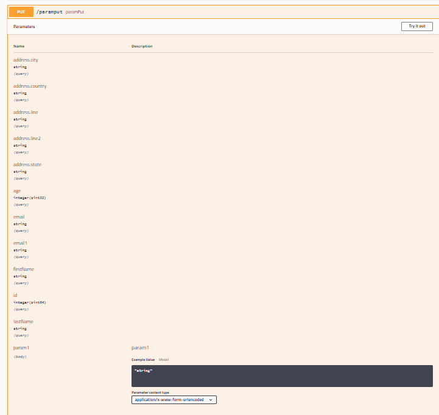

Quick related note: While the swagger specifications resulting from this enriching library have all the information like the minLength etc for the parameters, only in case of parameters (unlike with the model definitions) the swagger ui needs a little help in rendering the same information. That is taken care of additionally by this library. 

##### Better handling of generic collections
###### Try GenericsControllerUsingValid.getList2() or /pqr16  
With regular swagger an expression of this sort   
* List<List<Map<String, List<String>>>>  
causes this error.  
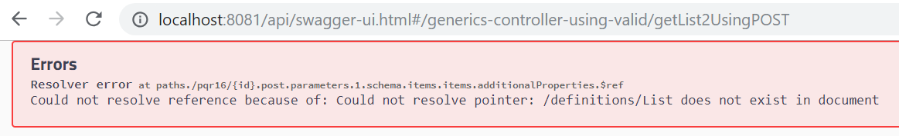

###### This spring-swagger-simplfied project 
* does not repeat this error
* also its representation conforms to below
[Data Types](https://swagger.io/docs/specification/data-models/data-types/)

##### Regular swagger XML examples
###### Try GenericsControllerUsingValid.abc1() or /pqr  
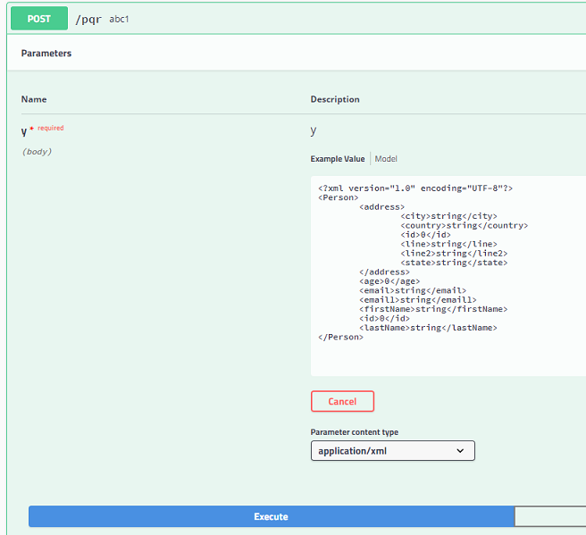
###### causes below error
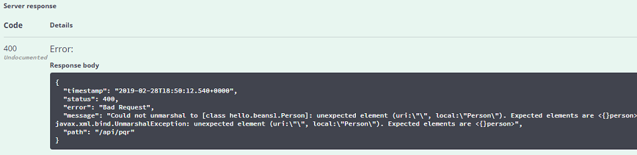
##### Enriched swagger XML examples
###### Try same GenericsControllerUsingValid.abc1() or /pqr  
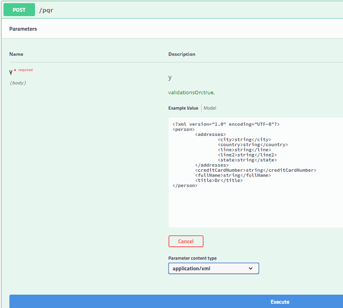
###### causes below response
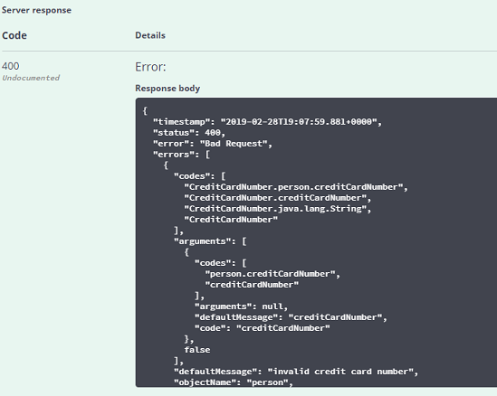
  
##### Controller Advice detection in extra features in simplified-swagger-extra-demo
###### Try ExceptionConceptController.java  
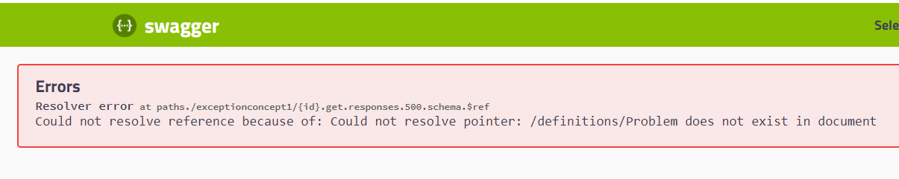
In simplified-swagger-extra-demo you wont have this problem because it detects the controller advices and prepares the needed Model without extra effort.

###### Using spring-swagger-simplified  
Maven dependency spring-swagger-simplified[1.0.3] solves this apiInfo issue.
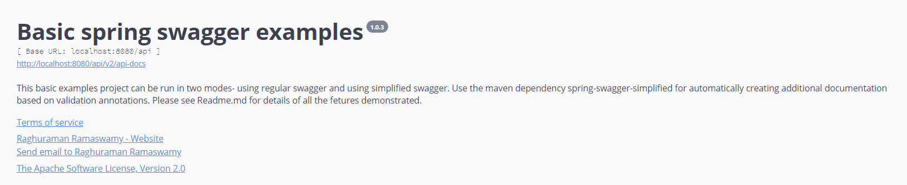
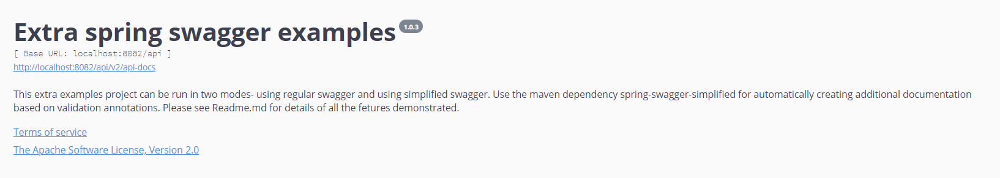
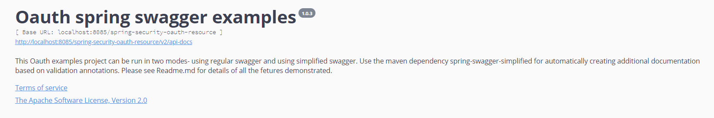

##### General Note on validations
* The library only tries to ensure the annotations get used properly in the generated swagger specs. The actual validation is executed by the underlying framework that processes the annotations at runtime. That said there are adequate illustrative examples provided.

### Supported Validation annotations.
While its fairly easy to make the library understand any constraint validation annotation. Currently out of the box it supports the following: 
CreditCardNumber, DateTimeFormat, Email, JsonFormat, Max, Min, NotNull, NotBlank, Pattern, Size, Valid, Validated  
In addition to the above have also demonstrated how easy its to bring into a project any other and even custom annotations.  

### ApiXXX annotations.

#### ApiOperation annotations.
Implementation is by ApiOperationSwaggerDecorator.java
Ignoring these attributes: httpMethod, response, responseContainer, ignoreJsonView, protocols, responseHeaders, responseReference.

#### ApiParam annotations.
Implementation is not by a **SwaggerDecorator.java.

Ignoring these attributes: allowEmptyValue, collectionFormat, responseContainer, ignoreJsonView, protocols, responseHeaders, responseReference.

#### @ApiResponses/@ApiResponse annotations.
Implementation is by ApiResponsesSwaggerDecorator.java
Ignoring these attributes: apiResponse.responseHeaders, apiResponse.responseContainer, apiResponse.reference  
Unlike original spring fox when using @ApiResponses/@ApiResponse expecting the entries to be specified entirely by the annotations. No assuming whats not specified. When @ApiResponses/@ApiResponse is not specified of course we provide the standard response entries.  

#### ApiModelProperty annotations.
Implementation is by ApiModelPropertySwaggerDecorator.java
Even though trying to ignore some attributes as shown below its possible that they might not be really ignored. This is because unless its a generic bean we are not creating the actual bean model with the properties. We are using the already built models and properties for non generic beans. Will fix this properly when we do the swagger 3 version. If needed will do earlier. What this means (only for ApiModelProperty) is some advanced stuff of not applying say hidden or rather ignoring hidden to a property that has say @NotNull may get missed unless the bean for the property is a generic bean.
Ignoring (trying to) these attributes: reference, required, access, allowEmptyValue, dataType, name. 
If we determine a field must be required because of say @NotNull we prevent applying hidden to it.

### How do I get set up? ###

* clone the repository git clone https://tek-nik@bitbucket.org/tek-nik/simplified-swagger-examples.git
* Run mvn clean package  in master branch.

Note: spring-swagger-simplified Organizes the beans using the spring bean names in the swagger ui. 

#### Demo of the basics ####  

* run java -jar basic-examples/simplified-swagger-demo/target/simplified-swagger-demo.jar
* check using http://localhost:8080/api/swagger-ui.html
* run java -jar basic-examples/regular-swagger-demo/target/regular-swagger-demo.jar
* check using http://localhost:8081/api/swagger-ui.html
*  __Compare the two and hope you will find the simplified-swagger-demo useful__
 
 
#### Demo of the extra features ####    

* run java -jar basic-examples/simplified-swagger-extra-demo/target/simplified-swagger-extra-demo.jar  
* check using http://localhost:8082/api/swagger-ui.html  
* run java -jar basic-examples/regular-swagger-extra-demo/target/regular-swagger-extra-demo.jar  
* check using http://localhost:8083/api/swagger-ui.html  
* __Compare the two and hope you will find the simplified-swagger-extra-demo useful__  

Extra Features Provided:  
* Demonstration of global exception handling  
* @ControllerAdvice detection (only in simplified swagger)  
* Global setting of responses using SwaggerConfig 
* How the models specified in the  @ControllerAdvice can be leveraged in SwaggerConfig (only in simplified swagger)  
* Swagger security - especially how to inject header based tokens when making requests via swagger ui 
* For these features read simplified-swagger-examples\simplified-swagger-extra-demo\src\main\java\hello\SwaggerConfig.java and implified-swagger-examples\regular-swagger-extra-demo\src\main\java\hello\SwaggerConfig.java, regular-swagger-extra-demo\src\main\java\hello\GlobalControllerAdvice.java,  simplified-swagger-extra-demo\src\main\java\hello\GlobalControllerAdvice.java.  
Try out hello\controllers\ExampleApiOperationController.java and hello\controllers\ExceptionConceptController.java

#### Demo of the oauth example ####    
* run java -jar oauth-example/oauth-authorization-server/target/oauth-authorization-server.jar
* run java -jar oauth-example/oauth-resource-server-with-simplified-swagger/target/oauth-resource-server-with-simplified-swagger.jar   
* check using http://localhost:8085/spring-security-oauth-resource/swagger-ui.html  
* run java -jar oauth-example/oauth-resource-server-with-swagger/target/oauth-resource-server-with-swagger.jar  
* check using http://localhost:8086/spring-security-oauth-resource/swagger-ui.html  
* Important Note: For bar_r_w you must provide barClientIdPassword as clientId. ClientId for the remaining prompts can be left at fooClientIdPassword. For The user credentials use tom and 111. 
* __Compare the two and hope you will find the oauth-resource-server-with-simplified-swagger useful__  

Oauth example Provided:  
* The Oauth example borrows from and slightly modifies examples provided by baeldung and is mentioned in references.
* It seeks to MAINLY showcase the value adds of spring-swagger-simplified maven jar
* It also additionally Demonstrates global exception handling  
* @ControllerAdvice detection (only in simplified swagger)  
* Global setting of responses using SwaggerConfig 

### References ###

* [Approach A- Swagger tutorial](https://www.baeldung.com/swagger-2-documentation-for-spring-rest-api)
* [Approach B- Swagger tutorial](https://dzone.com/articles/spring-boot-swagger-ui)
* [Min Length](https://stackoverflow.com/questions/33753340/is-there-a-way-to-indicate-that-a-string-model-property-has-a-maximum-length-in/51935210#51935210)
* [Data Types](https://swagger.io/docs/specification/data-models/data-types/)

### TODO Next (Not necessarily in same order)###

* Improve handling of @ApiModelProperty for non generic beans  
* This has been demonstrated for spring boot and spring 4. Also demonstrate for spring 5 (at least without router functions and handler i.e. when using @RestController).   
* Maybe provide support for spring rest data jpa.
* Provide swagger 3 spring fox implementation

 